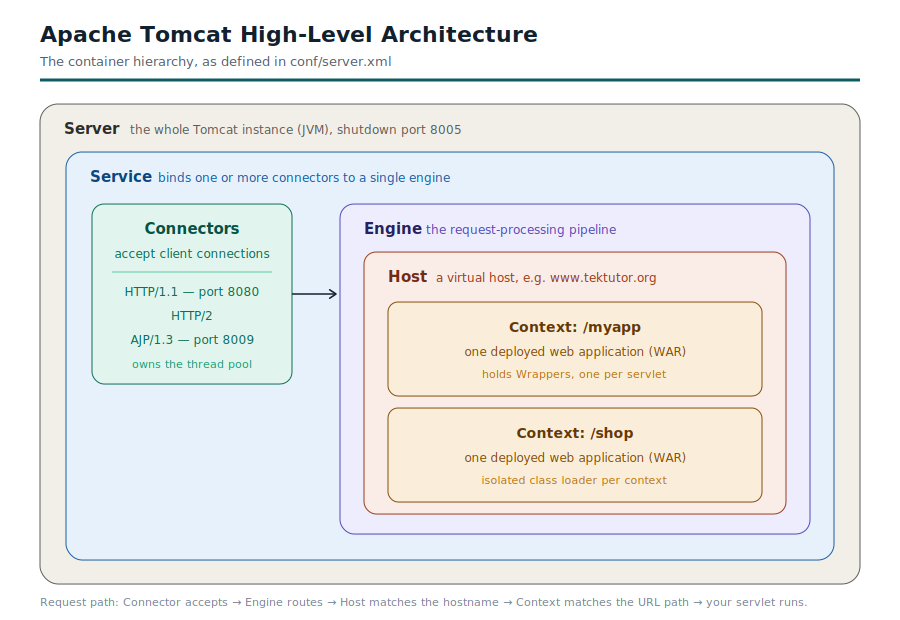

# Day 1

## URLs for Feed and pre-test links - Access from RPS Cloud Lab machine
In case you have some issues accessing feedback and/or pre-test link, kindly contact Srinath from RPS on his mobile 6303416523 
<pre>
https://notepad.pw/DevOps13
</pre>  

## Lab - Installing Visual Studio Code editor in Ubuntu
```
echo "code code/add-microsoft-repo boolean true" | sudo debconf-set-selections
sudo apt install wget gpg &&
wget -qO- https://packages.microsoft.com/keys/microsoft.asc | sudo gpg --dearmor -o /usr/share/keyrings/microsoft.gpg
```

Add the Visual studio code repository url
```
sudo tee /etc/apt/sources.list.d/vscode.sources > /dev/null << 'EOF'

Types: deb
URIs: https://packages.microsoft.com/repos/code
Suites: stable
Components: main
Architectures: amd64,arm64,armhf
Signed-By: /usr/share/keyrings/microsoft.gpg
EOF
```

Install Visual studio code editor
```
sudo apt update &&
sudo apt install code # or code-insiders
```

## Info - Servlet Overview
<pre>
- A Servlet class is a Java class that handles HTTP requests
- It becomes a servlet by extending HttpServlet and getting registered with the container
- HttpServlet gives you the method-dispatch machinery, so you override doGet, doPost, and
  the rest instead of writing raw request handling
- @WebServlet("/hello") registers the class and maps it to a URL pattern
- Servlet is created and controlled by the Servlet container
</pre>

Below is a simple servlet
<pre>
package org.tektutor;

import jakarta.servlet.annotation.WebServlet;
import jakarta.servlet.http.HttpServlet;
import jakarta.servlet.http.HttpServletRequest;
import jakarta.servlet.http.HttpServletResponse;
import java.io.IOException;

@WebServlet("/hello")
public class HelloServlet extends HttpServlet {

    @Override
    protected void doGet(HttpServletRequest req, HttpServletResponse resp)
            throws IOException {
        resp.setContentType("text/plain");
        resp.getWriter().write("Hello from Tomcat");
    }
}
</pre>

## Info - Bean Overview
<pre>
- A Bean is a different of Object
- It is a plain Java class whose lifecycle a container manages for you,
  you never write new(allocate/delete) for it
- In the CDI(Context Dependency Injection) word, most classes qualify as beans automatically once CDI is switched on
</pre>

Below is a simple Bean
<pre>
package org.tektutor;

import jakarta.enterprise.context.ApplicationScoped;

@ApplicationScoped
public class GreetingService {
    public String greet(String name) {
        return "Hello " + name + " from Tomcat";
    }
}
</pre>

## Info - Apache Tomcat Overview
<pre>
- Apache Tomcat is an open source web server and servlet container maintained by the Apache Software Foundation
- It runs Java web applications by implementing the Jakarta Servlet, Jakarta Server Pages(JSP),
  Jakarta Expression Language and WebSocket specifications
- Tomcat is not a full JAVA EE application server
- It handles the web tier( Servlets and JSP, but it doesn't ship with EJB, JMS, or full CDI support like
  WildFly or WebSphere do )
- Most teams pick Tomcat because it stays lightweight and starts fast.
- You run it when your application  needs a servlet container and nothing heavier
</pre>

#### What Apache Tomcat does ?
<pre>
- When a request hits Tomcat, it maps the URL to a Servlet, run your Java code, and retuns the response.
- It manages the HTTP connection, request threading, session state, and the Servlet lifecycle
- You deploy an application as a WAR file or an exploded directory under webapps
</pre>

#### Core Components<pre>
<pre>
- Server
  - the top-level element, that represents the whole Tomcat instance
  - Listens on port 8005 for shutdown commands by default
- Service
  - groups one or more Connectors with a Single Engine
  
- Connector
  - accepts client connections on a port
  - The HTTP/1.1 connector defautls to port 8080
  - You can add an AJP connector or an HTTP/2 connector

- Engine
  - the request-processing pipeline that handles all requests for a Service
  
- Host
  - a virtual host, like www.tektutor.org, mapped to a set of applications

- Context
  - a single web application, mapped to a URL path such /myapp
</pre>

## Info - Tomcat High-Level Architecture


## Info - Tomcat Directory Layout
<pre>
bin 
- startup and shutdown scripts 
- catalina.sh
- startup.sh
- shutdown.sh
conf
- it has configurations,including server.xml, web.xml, tomcat-users.xml 
webapps
- deployed applications can be found here ( all the wars files )
logs
- catalina.out and access.logs
lib
- Tomcat and shared libraries
temp and work
- scratchspace and compiled JSPs
</pre>

## Info - conf/server.xml
conf/server.xml
<pre>
- The blueprint for the whole server
- Read it top down and the nesting tells you the architecture
- server.xml is only read at startup. 
- If you edit it, and nothing happens until you restart the Tomcat serrver
</pre>  
```
<Server port="8005">          one JVM
  <Service name="Catalina">   one engine + its connectors
    <Connector port="8080"/>  the doors
    <Engine name="Catalina" defaultHost="localhost">
      <Host name="localhost" appBase="webapps" unpackWARs="true" autoDeploy="true">
        <Context .../>        optional; usually defined elsewhere
      </Host>
    </Engine>
  </Service>
</Server>
```

## Info - conf/context.xml
<pre>
- Global defaults applied to every web application
- Its job is per-application settings, not per-server settings
- Resource xml element can be used to capture JNDI datasources shared by all apps
- tells which resources must be monitored for changes, and when those files are updated,
  tomcat reloads those application
</pre>

A Sample context.xml that I took from tomcat10 looks as below
```
<Context>

    <!-- Default set of monitored resources. If one of these changes, the    -->
    <!-- web application will be reloaded.                                   -->
    <WatchedResource>WEB-INF/web.xml</WatchedResource>
    <WatchedResource>WEB-INF/tomcat-web.xml</WatchedResource>
    <WatchedResource>${catalina.base}/conf/web.xml</WatchedResource>

    <!-- Uncomment this to enable session persistence across Tomcat restarts -->
    <!--
    <Manager pathname="SESSIONS.ser" />
    -->
</Context>
```

## Info - conf/web.xml
<pre>
- The global deployment descriptor
- Every deployed app inherits it, then overlays its own WEB-INF/web.xml
- Two servlets are declared here and both are worth showing:
  - DefaultServlet serves static files. 
  - Its listings parameter is false, which is why you get 404 instead of a directory listing
  - JspServlet compiles JSPs
  - Its development=true setting is why a JSP change takes effect without redeploy
  - Set it to false in production; it stops the timestamp check on every request.
</pre>  

A sample conf/web.xml looks as below
```
<web-app xmlns="https://jakarta.ee/xml/ns/jakartaee"
  xmlns:xsi="http://www.w3.org/2001/XMLSchema-instance"
  xsi:schemaLocation="https://jakarta.ee/xml/ns/jakartaee
                      https://jakarta.ee/xml/ns/jakartaee/web-app_6_0.xsd"
  version="6.0">

    <session-config>
        <session-timeout>30</session-timeout>
    </session-config>

    <!-- there will be many mime type mappings in the actual file, I have just included 2 of them to give an ide -->
    <mime-mapping>
        <extension>zirz</extension>
        <mime-type>application/vnd.zul</mime-type>
    </mime-mapping>
    <mime-mapping>
        <extension>zmm</extension>
        <mime-type>application/vnd.handheld-entertainment+xml</mime-type>
    </mime-mapping>

    <welcome-file-list>
        <welcome-file>index.html</welcome-file>
        <welcome-file>index.htm</welcome-file>
        <welcome-file>index.jsp</welcome-file>
    </welcome-file-list>

</web-app>
```

## Info- conf/tomcat-users.xml
<pre>
- Users, passwords, and roles for the Manager and Host Manager apps
- Ships with everything commented out
- an out-of-the-box Tomcat has no accounts at all
</pre>

A sample configured conf/tomcat-users.xml looks as below
```
<role rolename="manager-gui"/>
<role rolename="manager-script"/>
<user username="admin" password="s3cret" roles="manager-gui"/>
<user username="deployer" password="d3ploy" roles="manager-script"/>
```

## Info - Apache Tomcat 9 specifics
<pre>
- Apache Tomcat 9 uses javax.* namespace in Servlet applications
- Oracle made Java EE as an opensource project by donating it to Eclipse Foundation
- Requires minimum JDK 8
- Tomcat 9 supports
  - Servlet specification v4.0
  - JSP v2.3
  - WebSocket v1.1
  - Weld 3.x
  - HTTP/2 ( by default )
</pre>

Tomcat 9 pom.xml
```
<dependency>
  <groupId>javax.servlet</groupId>
  <artifactId>javax.servlet-api</artifactId>
  <version>4.0.1</version>
  <scope>provided</scope>
</dependency>
```

## Info - Tomcat 10 specifics
<pre>
- Apache 10 uses jakarta.* namespace due to the Java trademark issue
- The Servelet that was built for Tomcat9 will not work in Tomcat 10.x or 11.x
- Requires minimum JDK 11
- Tomcat 10 supports
  - Jakarta Servlet specification v3.1
  - WebSocket v2.1
  - Weld 5.x
  - HTTP/2 ( Default )
</pre>  

Tomcat 10 pom.xml
```
<dependency>
  <groupId>jakarta.servlet</groupId>
  <artifactId>jakarta.servlet-api</artifactId>
  <version>6.0</version>
  <scope>provided</scope>
</dependency>
```

## Lab - Deploying web application into Tomcat 10 Server
```
cd ~/devops-july-2026
git pull
cd Day1/tomcat10/hello-servlet
mvn clean package

# Check if Tomcat 10 Web server is running
sudo systemctl status tomcat10

# Once you know Tomcat 10 server is up and running normally, you may deploy the application
sudo cp target/hello-tomcat-servlet.war /opt/tomcat10/webapps/

# Test your application
curl "http://localhost:8090/hello-tomcat-servlet/hello?name=Tomcat!"
```

## Info - Tomcat 11 specifics
<pre>
- Tomcat 11 targets Jakarta EE 11 and requires Java 17 a minimum requirement
- It uses the jakarta.* namespace not the older javax.*
- Applications written for Tomcat 9 or earlier will not run unmodified, since the package rename breaks
  import statements
- this matters when you migrate legacy apps
- Change the HTTP port by editing the Connector port attribute in server.xml from 8080 to 8081
- Set JVM memory by adding CATALINAT_OPTS="Xms512m" -Xmx1024m" to bin/setenv.sh
- Enable HTTPS by configuring an SSL Connector with a keystore
- one operational detail worth noting
  - if you run Tomcat under a dedicated tomcat user
  - set file ownership correctly on the install directory
  - wrong ownership causes setenv.sh to be skipped silently and CATALINS_OPTS shows up blank at
  ownership correctly on the install directory
</pre>

## Vim editor basics


## Lab - Install Tomcat9 in Ubuntu 

Open a terminal 1, type the below commands
```
sudo apt update
sudo apt install -y openjdk-17-jdk
java -version
javac -version
```

Create a dedicated folder for Tomcat9 in Terminal 1
```
sudo mkdir -p /opt/tomcat9
sudo useradd -r -m -U -d /opt/tomcat9 -s /bin/false tomcat
```

Download and Install Tomcat9 in Terminal 1
```
cd /tmp
wget https://dlcdn.apache.org/tomcat/tomcat-9/v9.0.120/bin/apache-tomcat-9.0.120.tar.gz
sudo tar -xzf apache-tomcat-9.0.120.tar.gz -C /opt/tomcat9 --strip-components=1
```

Change ownership of /opt/tomcat9 folder to tomcat user in Terminal 1
```
sudo chown -R tomcat:tomcat /opt/tomcat9
sudo chmod -R u+x /opt/tomcat9/bin
```

Configure the JVM settings in Terminal 1
```
sudo tee /opt/tomcat9/bin/setenv.sh > /dev/null <<'EOF'
export JAVA_HOME=/usr/lib/jvm/java-17-openjdk-amd64
export CATALINA_OPTS="-Xms512m -Xmx1024m"
EOF
```

Change the ownership of setenv.sh script to tomcat user in Terminal 1
```
sudo chown tomcat:tomcat /opt/tomcat9/bin/setenv.sh
sudo chmod +x /opt/tomcat9/bin/setenv.sh
```

Run Tomcat9 as a linux service in Terminal 1
```
sudo tee /etc/systemd/system/tomcat9.service > /dev/null << 'EOF'
[Unit]
Description=Apache Tomcat 9
After=network.target

[Service]
Type=forking

User=tomcat
Group=tomcat

Environment="JAVA_HOME=/usr/lib/jvm/java-17-openjdk-amd64"
Environment="CATALINA_HOME=/opt/tomcat9"
Environment="CATALINA_BASE=/opt/tomcat9"
Environment="CATALINA_PID=/opt/tomcat9/temp/tomcat.pid"

ExecStart=/opt/tomcat9/bin/startup.sh
ExecStop=/opt/tomcat9/bin/shutdown.sh

Restart=on-failure

[Install]
WantedBy=multi-user.target
EOF
```

Start the service in Terminal 1
```
# The command below will ensure the new and existing service configurations are re-loaded 
sudo systemctl daemon-reload

# The command below will ensure, the next time the linux machine is rebooted, this service will be started automatic
sudo systemctl enable tomcat9

# In the current session, though we enabled the service we need manually start the service
sudo systemctl start tomcat9

# Command below, tells you current status of the service
sudo systemctl status tomcat9
```

Test in Terminal 1
```
curl http://localhost:8080
```

Watch live log in Terminal 2
```
sudo tail -f /opt/tomcat9/logs/catalina.out
```

## Lab - Deploying a Hello World Servlet into Tomcat 9
Install Maven Build Tool in Ubuntu
```
sudo apt update && sudo apt install -y maven
mvn --version
```

Clone the TekTutor Training Repository
```
cd ~
git clone https://github.com/tektutor/devops-july-2026.git
cd devops-july-2026
```

Compiling the Servlet application
```
cd ~/devops-july-2026
git pull
cd Day1/tomcat9/hello-servlet
tree
mvn clean package

# In case you got compilation error
git pull
mvn clean package
```


Deploy this servlet application into Apache Tomcat v9
```
cd ~/devops-july-2026/Day1/tomcat9/hello-servlet
sudo cp target/hello-tomcat-servlet.war /opt/tomcat9/webapps/
```

Test your application, in the below command replace 'Jegan' with your name
```
curl "http://localhost:8080/hello-tomcat-servlet/hello?name=Jegan"
```


## Lab - Install gedit editor ( use this in the place of vim editor - this works like Windows notepad )
```
sudo apt update && sudo apt install -y gedit
```

## Lab - Install Tomcat 10 in Ubuntu
In the Linux Terminal, type the below commands
```
sudo mkdir -p /opt/tomcat10
sudo useradd -r -m -U -d /opt/tomcat10 -s /bin/false tomcat10
```

Download and Install Apache Tomcat 10
```
cd /tmp
wget https://downloads01-he-fi.apache.org/tomcat/tomcat-10/v10.1.57/bin/apache-tomcat-10.1.57.tar.gz
sudo tar -xzf apache-tomcat-10.1.57.tar.gz -C /opt/tomcat10 --strip-components=1
```

Manage ownership
```
sudo chown -R tomcat10:tomcat10 /opt/tomcat10
sudo chmod -R u+x /opt/tomcat10/bin

JDK=$(readlink -f "$(which java)" | sed 's:/bin/java::')
sudo tee /opt/tomcat10/bin/setenv.sh > /dev/null <<EOF
export JAVA_HOME=$JDK
export CATALINA_OPTS="-Xms512m -Xmx1024m"
EOF
```

Manage the ownership
```
sudo chown tomcat10:tomcat10 /opt/tomcat10/bin/setenv.sh
sudo chmod +x /opt/tomcat10/bin/setenv.sh
sudo cat /opt/tomcat10/bin/setenv.sh
```

Change the port so it doesn't conflict with tomcat9
```
sudo vim /opt/tomcat10/conf/server.xml
# Change the shutdown port from 8005 to 8006
# Change the HTTP connector port from 8080 to 8090
# If AJP port is uncommented from 8009 to 8010
```

Create a service for Tomcat 10
```
sudo tee /etc/systemd/system/tomcat10.service > /dev/null << 'EOF'
[Unit]
Description=Apache Tomcat 10.1
After=network.target

[Service]
Type=forking

User=tomcat10
Group=tomcat10

Environment="JAVA_HOME=/usr/lib/jvm/java-17-openjdk-amd64"
Environment="CATALINA_HOME=/opt/tomcat10"
Environment="CATALINA_BASE=/opt/tomcat10"
Environment="CATALINA_PID=/opt/tomcat10/temp/tomcat.pid"

ExecStart=/opt/tomcat10/bin/startup.sh
ExecStop=/opt/tomcat10/bin/shutdown.sh

Restart=on-failure

[Install]
WantedBy=multi-user.target
EOF
```

Start the service in Terminal 1
```
sudo systemctl daemon-reload
sudo systemctl enable tomcat10
sudo systemctl start tomcat10
sudo systemctl status tomcat10
```


Test in Terminal 1
```
curl http://localhost:8090
```


Watch live log in Terminal 2
```
sudo tail -f /opt/tomcat10/logs/catalina.out
```


## Lab - Install Tomcat11 in Ubuntu
```
sudo mkdir -p /opt/tomcat11
sudo useradd -r -m -U -d /opt/tomcat11 -s /bin/false tomcat11
```

Download and Install Tomcat 11
```
cd /tmp
wget https://dlcdn.apache.org/tomcat/tomcat-11/v11.0.24/bin/apache-tomcat-11.0.24.tar.gz
sudo tar -xzf apache-tomcat-11.0.24.tar.gz -C /opt/tomcat11 --strip-components=1
```

Manage ownership
```
sudo chown -R tomcat11:tomcat11 /opt/tomcat11
sudo chmod -R u+x /opt/tomcat11/bin

JDK=$(readlink -f "$(which java)" | sed 's:/bin/java::')
sudo tee /opt/tomcat11/bin/setenv.sh > /dev/null <<EOF
export JAVA_HOME=$JDK
export CATALINA_OPTS="-Xms512m -Xmx1024m"
EOF

sudo chown tomcat11:tomcat11 /opt/tomcat11/bin/setenv.sh
sudo chmod +x /opt/tomcat11/bin/setenv.sh
cat /opt/tomcat11/bin/setenv.sh
```

Change the ports
```
sudo nano /opt/tomcat11/conf/server.xml
```

Shutdown port from 8005 to 8007
```
<Server port="8007" shutdown="SHUTDOWN">
```
Http port from 8080 to 8100
```
<Connector port="8100" protocol="HTTP/1.1"
           connectionTimeout="20000"
           redirectPort="8443" />
```

AJP Connector Port if currently uncommented from 8009 to 8011

Create a service
```
sudo tee /etc/systemd/system/tomcat11.service > /dev/null <<'EOF'
[Unit]
Description=Apache Tomcat 11
After=network.target

[Service]
Type=forking

User=tomcat11
Group=tomcat11

Environment="JAVA_HOME=/usr/lib/jvm/java-21-openjdk-amd64"
Environment="CATALINA_HOME=/opt/tomcat11"
Environment="CATALINA_BASE=/opt/tomcat11"
Environment="CATALINA_PID=/opt/tomcat11/temp/tomcat.pid"

ExecStart=/opt/tomcat11/bin/startup.sh
ExecStop=/opt/tomcat11/bin/shutdown.sh

Restart=on-failure

[Install]
WantedBy=multi-user.target
EOF
```

Manage the service
```
sudo systemctl daemon-reload
sudo systemctl enable tomcat11
sudo systemctl start tomcat11
sudo systemctl status tomcat11
```

Verify if all 3 Tomcats are running
```
curl http://localhost:8080/   # Tomcat 9
curl http://localhost:8090/   # Tomcat 10
curl http://localhost:8100/   # Tomcat 11
sudo ss -ltnp | grep -E '8080|8090|8100|8005|8006|8007'
systemctl status tomcat9 tomcat10 tomcat11 --no-pager | grep -E 'tomcat|Active'
```

Deploy
```
cd ~/devops-july-2026/Day1/tomcat9/hello-servlet
mvn clean package
sudo cp target/hello-tomcat-servlet.war /opt/tomcat9/webapps/

cd ../../tomcat10/hello-servlet
mvn clean package
sudo cp target/hello-tomcat-servlet.war /opt/tomcat10/webapps/
sudo cp target/hello-tomcat-servlet.war /opt/tomcat11/webapps/
```

## Lab - Deploying using exploded directory
```
sudo mkdir -p /opt/tomcat11/webapps/hello2
sudo unzip ~/devops-july-2026/Day1/tomcat10/hello-servlet/target/hello-tomcat-servlet.war \
  -d /opt/tomcat11/webapps/hello2
```

Fix ownership
```
sudo chown -R tomcat11:tomcat11 /opt/tomcat11/webapps/hello2
```

Deploy
```
sudo tail -f /opt/tomcat11/logs/catalina.out
sudo systemctl restart tomcat11
curl "http://localhost:8100/hello2/hello?name=Tomcat11"
```

Undeploy
```
sudo rm -rf /opt/tomcat11/webapps/hello2
```

## Lab - Deploy using ROOT context

Remove existing ROOT
```
#Not removing, let's just rename the folder
sudo systemctl stop tomcat11
sudo mv /opt/tomcat11/webapps/ROOT /opt/tomcat11/ROOT1
sudo mv /opt/tomcat11/webapps/ROOT.war /opt/tomcat11/ROOT.war1
```

Copy your war as ROOT.war
```
sudo cp ~/devops-july-2026/Day1/tomcat10/hello-servlet/target/hello-tomcat-servlet.war \
  /opt/tomcat11/webapps/ROOT.war

sudo chown tomcat11:tomcat11 /opt/tomcat11/webapps/ROOT.war
```

Start and let it deploy
```
sudo systemctl start tomcat11
sudo tail -f /opt/tomcat11/logs/catalina.out
```

Access the page
```
curl "http://localhost:8100/hello?name=Jegan"
```

## Lab - Deploy application using manager-script

Enable manager-script user
```
sudo nano /opt/tomcat11/conf/tomcat-users.xml
```

Inside the <tomcat-users> element add an user with both roles
```
<role rolename="manager-script"/>
<role rolename="manager-gui"/>
<user username="deployer" password="S3cret-Change-Me" roles="manager-script,manager-gui"/>
```

Allow remote access
```
sudo nano /opt/tomcat11/webapps/manager/META-INF/context.xml
<Valve className="org.apache.catalina.valves.RemoteAddrValve"
       allow="127\.\d+\.\d+\.\d+|::1|0:0:0:0:0:0:0:1|192\.168\.\d+\.\d+"/>
```

Restart tomcat service
```
sudo systemctl restart tomcat11
```

Deploy with curl
```
curl --user deployer:S3cret-Change-Me \
  --upload-file ~/advanced-devops-2026/.../hello-cdi-servlet-tomcat10-11/target/hello-cdi-servlet.war \
  "http://localhost:8100/manager/text/deploy?path=/hello3&update=true"
```

Access from web browser
```
http://localhost:8100/hello3/hello?name=Jegan
```

Management console url
```
http://localhost:8100/manager/html
curl --user deployer:S3cret-Change-Me "http://localhost:8100/manager/text/list"
curl --user deployer:S3cret-Change-Me "http://localhost:8100/manager/text/reload?path=/hello3"
#Undeploy
curl --user deployer:S3cret-Change-Me "http://localhost:8100/manager/text/undeploy?path=/hello3"
```

## Lab - Deploy application using Maven
Add this in the pom.xml
```
<plugin>
    <groupId>org.codehaus.cargo</groupId>
    <artifactId>cargo-maven3-plugin</artifactId>
    <version>1.10.20</version>
    <configuration>
        <container>
            <containerId>tomcat11x</containerId>
            <type>remote</type>
        </container>
        <configuration>
            <type>runtime</type>
            <properties>
                <cargo.remote.uri>http://localhost:8100/manager/text</cargo.remote.uri>
                <cargo.remote.username>deployer</cargo.remote.username>
                <cargo.remote.password>S3cret-Change-Me</cargo.remote.password>
            </properties>
        </configuration>
        <deployables>
            <deployable>
                <groupId>org.tektutor</groupId>
                <artifactId>hello-cdi-servlet-tomcat10-11</artifactId>
                <type>war</type>
                <properties>
                    <context>/hello4</context>
                </properties>
            </deployable>
        </deployables>
    </configuration>
</plugin>
```

Deploy
```
mvn clean package cargo:deploy
```

Redeploy
```
mvn clean package cargo:redeploy
```

Verify
```
curl "http://localhost:8100/hello4/hello?name=Jegan"
```
